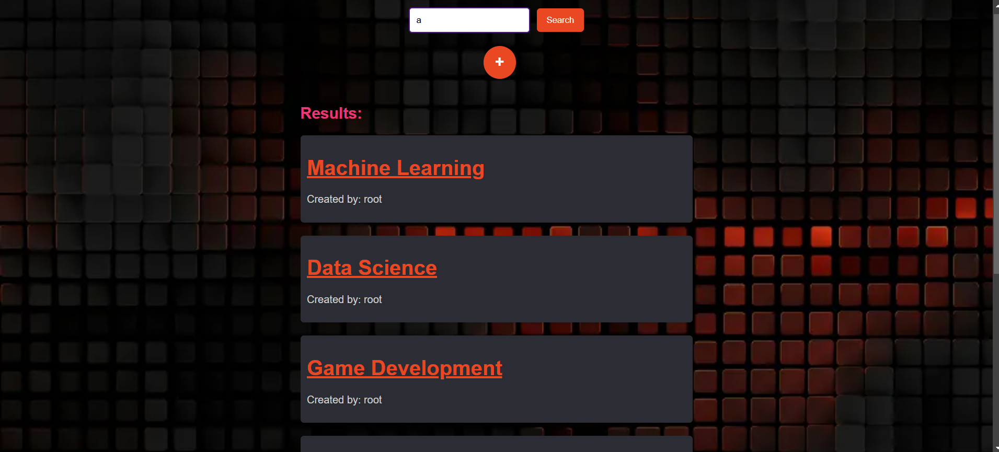

<!-- PROJECT LOGO -->
<br />
<div align="center">
  <a href="https://github.com/yourusername/Feminashield">
    
  </a>

  <h3 align="center">Feminashield</h3>

  <p align="center">
    A toolkit designed to empower women for safer web browsing and community support.
    <br />
  </p>
  <a href="#"><strong>View The Demo »</strong></a>

</div>

<!-- TABLE OF CONTENTS -->
<details>
  <summary>Table of Contents</summary>
  <ol>
    <li><a href="#about-the-project">About The Project</a></li>
    <li><a href="#features">Features</a></li>
    <li><a href="#built-with">Built With</a></li>
    <li><a href="#getting-started">Getting Started</a>
      <ul>
        <li><a href="#prerequisites">Prerequisites</a></li>
        <li><a href="#installation">Installation</a></li>
      </ul>
    </li>
    <li><a href="#usage">Usage</a></li>
    <li><a href="#contact-us">Contact Us</a></li>
  </ol>
</details>

<!-- ABOUT THE PROJECT -->

## About The Project

Feminashield is a browser extension toolkit aimed at creating a safer online experience for women. It focuses on empowering users through various features that promote community awareness and education.

## Features

### **Misogyny Content Masking**

Automatically masks misogynistic comments and memes on platforms like Facebook to enhance a positive browsing experience.

- 
- 
- 
- 

### **Neighborhood Safety Mapping**

Users can tag and report dangerous locations in their neighborhoods, helping others avoid unsafe areas.

- 
- 
- 
- 
- 

### **Learning Roadmaps**

The extension allows women to recommend educational resources and collaboratively build roadmaps. Users can highlight parts of their studies they find challenging and receive targeted advice from the community.

- 
- 
- 
- 

### **Content Tagging**

A feature enabling users to tag links and content that empower women, fostering a collaborative community of support and encouragement.

### Built With

- [](https://reactjs.org/)
- [](https://expressjs.com/)
- [](https://www.typescriptlang.org/)
- [](https://fastapi.tiangolo.com/)
- [](https://pytorch.org/)
- [](https://huggingface.co/)

<p align="right">(<a href="#readme-top">back to top</a>)</p>

<!-- GETTING STARTED -->

## Getting Started

To get started with Feminashield, follow these instructions to set up the project on your local machine.

### Prerequisites

Ensure you have the following installed:

- Node.js
- Python
- Any other dependencies listed in the project's setup documentation.

### Installation

1. Clone the repository:
   ```bash
   git clone https://github.com/yourusername/Feminashield.git
   ```

2. run the web server (currently we're still using the vite dev server but in reality we will build the frontend and add it as a static route in the backend):
   ```bash
   cd webserver
   npm run dev &
   cd server
   npm start 
   ```
3. run the ai filtering fastapi backend using the following command:
  ```bash
  cd filter_backend
  pip install -r requirements.txt
  python src/infer_comm.py
```


3. to add the extension your browser you have to navigate to chrome://extensions , enable developer mode and click load unpacked extension. then select the "extension" folder

